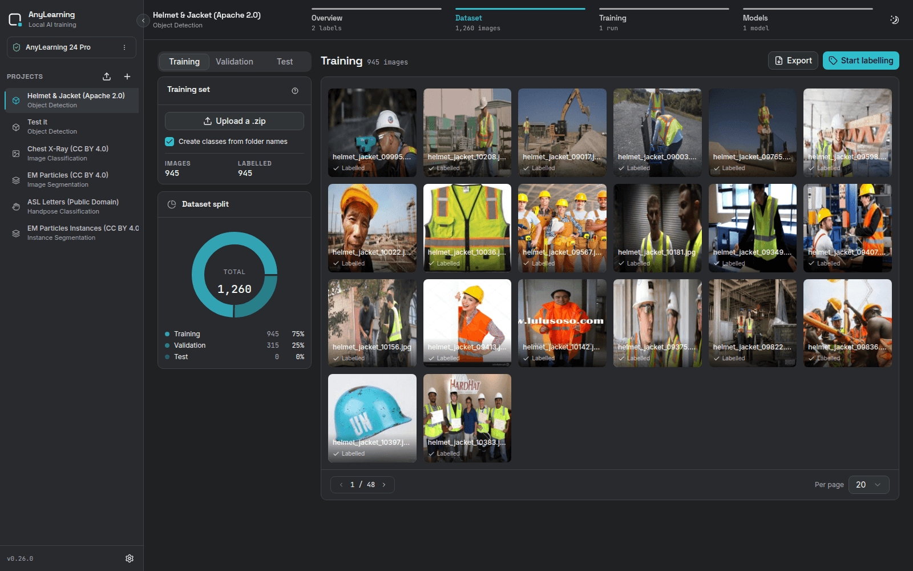
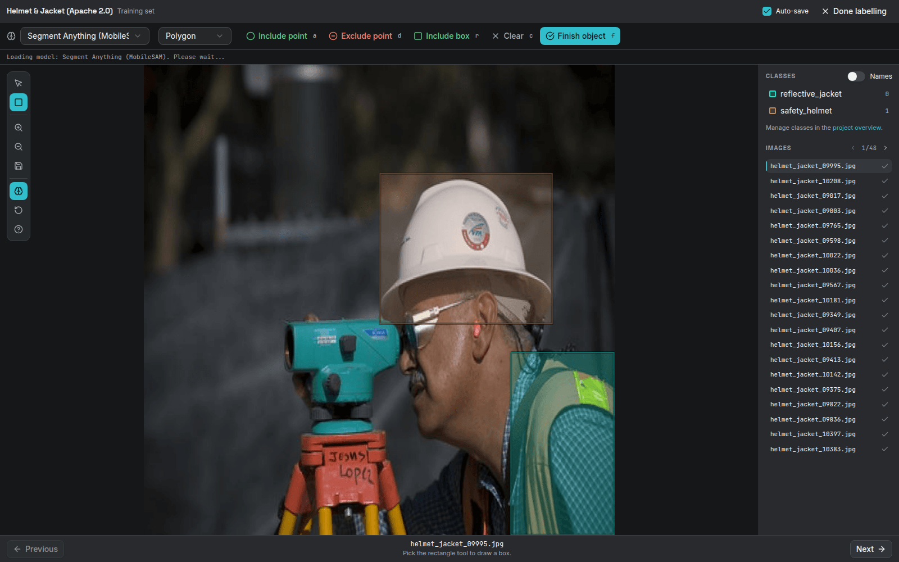
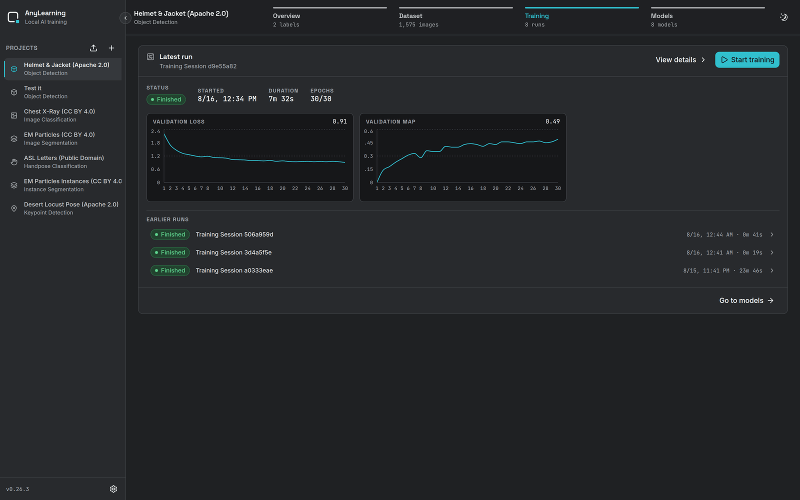

# AnyLearning

[](https://github.com/nrl-ai/anylearning-oss/actions/workflows/pre-commit.yml)
[](https://github.com/nrl-ai/anylearning-oss/actions/workflows/tests.yml)
[](LICENSE)

AnyLearning is an open-source, offline desktop application for labeling data,
training machine-learning models, and exporting them for deployment. Your
datasets and trained weights stay on your machine.

**Website:** [https://anylearning-oss.nrl.ai](https://anylearning-oss.nrl.ai)

**License:** [Apache License 2.0](LICENSE). Third-party code, models, datasets,
and generated notices retain their respective licenses; see
[LICENSES.md](LICENSES.md) and [MODEL_LICENCES.md](MODEL_LICENCES.md).

**What it does:**

- Label images with boxes, polygons, keypoints and whole-image classes.
  Promptable SAM-family models and automatic D-FINE/RF-DETR models run locally
  through the shared ONNX inference core, and the desktop app can import
  compatible YOLO-family ONNX models.
- Train eight project types on your own hardware: object detection, instance
  segmentation, image segmentation, image classification, handpose
  classification, keypoint detection, Tabular AI and Text AI.
- Export datasets to YOLO, COCO, LabelMe and AnyLabeling, and trained models to
  ONNX.
- Run without uploading data. Python, PyTorch, the training backbones, MobileSAM
  and the default SAM 2 models ship inside the installer. Larger optional
  auto-labeling models download only when you select them, are checksum-verified,
  and run locally thereafter. There is no account or activation key.

## Product tour



<table>
  <tr>
    <td width="50%">
      
    </td>
    <td width="50%">
      
    </td>
  </tr>
  <tr>
    <td align="center"><strong>Label precisely</strong></td>
    <td align="center"><strong>Train and compare locally</strong></td>
  </tr>
</table>

Explore the full walkthroughs in the
[documentation](https://anylearning-oss.nrl.ai/docs).

## Try the examples

The public [AnyLearning Examples](https://github.com/nrl-ai/anylearning-examples)
repository provides import-ready, license-reviewed recipes for image
classification, object detection, semantic segmentation, handpose
classification, keypoint detection, tabular AI, text classification, and
response evaluation. Its downloader fetches datasets from
[Hugging Face](https://huggingface.co/datasets/nrl-ai/anylearning-data) only
when you need them, so large archives do not live in this source tree.

The validated [RF-DETR Desert Locust keypoint model](https://huggingface.co/nrl-ai/anylearning-rfdetr-locust-keypoints)
is public too, with native and ONNX checkpoints, its exact schema, validation
metrics and an application-level held-out inference result.

## Repository layout

- `anylearning/`: Python backend and training pipelines
- `frontend/`: desktop application frontend
- `website/`: documentation and public website
- `tests/`: unit, integration, packaging, and training tests

The shared inference contracts, lifecycle, SAM adapters, and user-supplied YOLO
ONNX backend are documented in [`docs/inference.md`](docs/inference.md).
The desktop workflow and API are documented in
[`docs/auto_labeling.md`](docs/auto_labeling.md), and the pinned sources and
license decisions for supported ONNX models are recorded in
[`docs/onnx_model_sources.md`](docs/onnx_model_sources.md).
The separate password-authenticated public service boundary is documented in
[`docs/server.md`](docs/server.md).

## Development

### 1. Install dependencies for frontend

**Requirements:**

- Node.js v22.7.0 (Installing via [nvm](https://github.com/nvm-sh/nvm)).
- Install the dependencies:

```shell
cd frontend
corepack enable
pnpm install --frozen-lockfile
```

### 2. Run your backend

**Requirements:**

- Miniconda or Anaconda
- **Python 3.13** (recommended). 3.11 is the minimum `setup.py` accepts, and
  3.13 is what CI builds and tests on. On 3.10 `pip install -e .` refuses to
  install anything.
- Install the dependencies:

```shell
conda create -n anylearning python=3.13
conda activate anylearning
bash -i install_env.sh

# For Anaconda/Miniconda
conda install libpython-static

# On Ubuntu
sudo apt install patchelf libpango1.0-dev libgif-dev
```

- Run web server for development:

```shell
python -m anylearning.app --port 5678 --development
```

### 3. Run your frontend

- Run the app:

```shell
pnpm dev
```

The app will be available at <http://localhost:3021/>.

### 4. Run the desktop app

- Build frontend - Must be done before running the backend:

```shell
bash build_frontend.sh
```

- Terminate the backend/frontend if it is running from previous steps. The desktop app will use the same port and serve the built frontend itself.

- Run the app:

```shell
python -m anylearning.app
```

A window will pop up and you can start using the app.

#### Database migration

- Create a migration file:

```shell
alembic revision --autogenerate -m "migration_name"
```

- Rerun the app and the migration will be applied automatically.

## Build

Builds on Linux, macOS and Windows; `.github/workflows/build.yml` produces all
three. Build on **Linux locally** while developing, then use CI for the other
platforms.

- Install all dependencies above, plus the packaging-only ones: `patchelf` on
  Linux, and `conda install libpython-static` on Anaconda/Miniconda Python,
  without which Nuitka aborts with "Automatic detection of static libpython
  failed".

- Install the dependencies for building:

```shell
pip install -r requirements.txt
```

- Build the app (~1 hour cold):

```shell
bash build_app.sh
```

- **Verify it before shipping it.** A Nuitka build that compiles and links can
  still be broken: one produced a 780 MB binary that segfaulted on startup
  because a module was dropped from the compiled set, and nothing in the build
  said so.

```shell
bash smoke_test_build.sh ./app.dist/app.bin       # starts it, checks API, routes, frontend
python smoke_test_training.py ./app.dist/app.bin  # every project type, on GPU and CPU
```

On macOS, a successful build produces `AnyLearning.app`. Drag it to the `Applications` folder and run it.

Run app from terminal:

```shell
open AnyLearning.app/Contents/MacOS/app
```

### macOS packaging

For a release, build the disk image. That is what goes on the website:

```shell
bash make_dmg.sh          # AnyLearning-macOS-<arch>-<version>.dmg
```

For a build you are only handing to someone to try, a zip is enough:

```shell
ditto -c -k --keepParent AnyLearning.app AnyLearning.zip
```

Either way, read the signing note in `docs/release_testing.md` before
publishing: unsigned builds are refused by Gatekeeper on every Mac but the one
that built them, and the user is told the app is damaged rather than unsigned.

**Fix the damaged app (if needed):**

After extracting, reset the quarantine attribute (recommended):

```shell
sudo xattr -rd com.apple.quarantine AnyLearning.app
```

If needed, restore proper permissions:

```shell
sudo chmod -R 755 AnyLearning.app
```

If needed, re-sign the app:

```shell
codesign --force --deep --sign - AnyLearning.app
```

### Windows packaging

`build_app.sh` leaves `AnyLearning.App\`; Inno Setup turns it into a setup
executable:

```shell
"$LOCALAPPDATA/Programs/Inno Setup 6/ISCC.exe" AnyLearning-Windows-Setup.iss
```

The version comes from `installer_version.iss`, which `build_app.sh` generates
from `anylearning/app_info.py`, so build first, and never edit the version in
the `.iss` files. Compressing a CUDA-enabled build takes around half an hour.

## Testing

Install the repository hooks once per clone and run the complete quality suite
before opening a pull request:

```shell
python -m pip install pre-commit==4.6.2
pre-commit install --install-hooks
pre-commit run --all-files
```

The hooks format and lint Python, JavaScript, TypeScript, Markdown, YAML, JSON,
CSS, and shell scripts. They also validate GitHub Actions and scan staged
changes for secrets with Gitleaks. See [CONTRIBUTING.md](CONTRIBUTING.md) for
the full development workflow.

Run everything, with coverage:

```shell
./run_tests.sh
```

Or just the tests:

```shell
pytest tests/
```

The default run is fully offline and needs no dataset download. `tests/e2e/`
takes every project type through its whole job (data, training, checkpoint,
ONNX export, and inference) once per model variant offered in the UI.

See [docs/testing.md](docs/testing.md) for the layout, the generated fixtures, and
how to run against the real datasets in
[anylearning-data](https://huggingface.co/datasets/nrl-ai/anylearning-data).

The standalone
[AnyLearning examples](https://github.com/nrl-ai/anylearning-examples/tree/main/examples/keypoint-detection)
repository includes generated stick figures and real-world keypoint validation
recipes.

Before publishing an installer, work through
[docs/release_testing.md](docs/release_testing.md), the per-OS acceptance
checklist. The unit suite says nothing about whether the _packaged_ app works.

Related:

- [docs/model_license_policy.md](docs/model_license_policy.md): which models and
  datasets may be integrated. Read this **before** adding either; AnyLearning
  can be redistributed. AGPL and non-commercial model licences require special
  review before integration.
- [docs/dependency_upgrade.md](docs/dependency_upgrade.md): how the dependency
  tiers work and what to know before moving torch.

## Contributing

Bug reports and pull requests are welcome. Read
[CONTRIBUTING.md](CONTRIBUTING.md) before proposing a substantial change.

## App icon

- Step 1: Create a 1024x1024 image.
- Step 2: Add a 224x224 rounded corners mask on the top left.
- Step 3: Add a 10% padding around the image.

A `.png` file can be provided as the app icon. You can also generate an `.icns`
file from `.png` with the following command:

```shell
bash make_icns.sh icon.png
```
