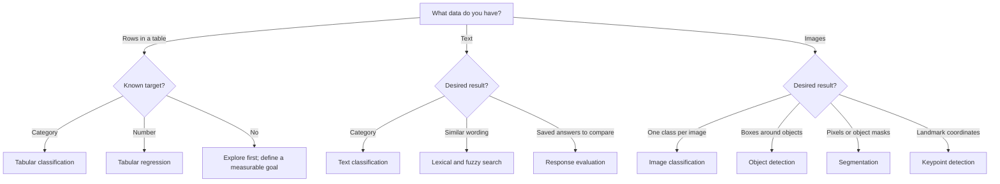

# Choosing a Machine-Learning Task

Start with the output a user needs. “Use AI” is not a task definition; “route
this message to one of 12 teams” is.

## Translate the outcome into a task

| You need | Choose | Example output |
|---|---|---|
| A category from a spreadsheet row | Tabular classification | `high_risk` |
| A number from a spreadsheet row | Tabular regression | `42.7 MPa` |
| A category from text | Text classification | `card_arrival` |
| Similar wording or likely duplicates | Lexical & fuzzy search | Ranked matching rows |
| Metrics over saved responses | Response evaluation | Completion and token F1 |
| One category for a whole image | Image classification | `healthy_leaf` |
| Objects and their locations | Object detection | Labelled bounding boxes |
| A class for every pixel or object mask | Segmentation | Pixel masks |
| Named landmarks | Keypoint detection | Joint coordinates |

## Define the prediction moment

Write one sentence before configuring a model:

> Using information available **at this moment**, predict **this output** for
> **this kind of case**, so that **this user can take this action**.

This sentence exposes leakage. If a churn model includes `cancellation_date`,
or a loan model includes a field created after approval, the held-out score can
look excellent while the deployed model is useless. Mark identifiers and
post-outcome fields as excluded features in Tabular AI.

## Prefer the simplest useful baseline

A majority-class prediction, average-value regression, lexical search or small
linear text classifier gives you a reference point. A more complex model earns
its cost only when it improves the metric that matters while meeting latency,
privacy and review requirements.

## Know when the task needs redesign

- If labels are subjective, write annotation guidance and measure reviewer agreement.
- If rare cases matter, choose balanced accuracy, macro F1, recall or another metric that exposes them.
- If future data differs from historical data, use a time-aware test set outside the current random-split workflow.
- If the desired output is free-form generation, AnyLearning's current Text AI workflows can organize or evaluate saved text, but they are not an LLM trainer.

Next: [evaluate models without fooling yourself](/docs/evaluating-ml-models).
