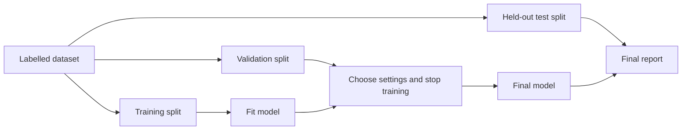
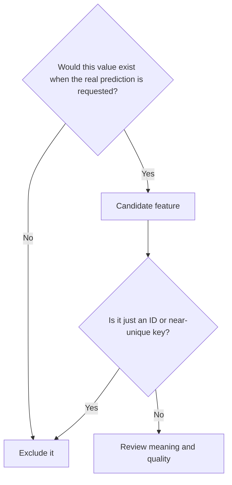

# Train, Validate and Test

Training success is not evidence that a model will work on new data. Keep
different examples for fitting, model decisions and final evaluation.

- **Training rows** fit the model.
- **Validation rows** guide settings and early stopping.
- **Test rows** estimate final performance and should not guide repeated tuning.

AnyLearning saves the proportions and random seed with the project. You can
change them in **Dataset → Configure**. Classification splits are stratified
when each class has enough examples, which helps preserve rare classes across
the partitions.

## Choose the metric before comparing runs

| Task | Useful metrics | Watch out for |
|---|---|---|
| Balanced classification | Accuracy, log loss | Accuracy hides which classes fail |
| Imbalanced classification | Balanced accuracy, macro F1, per-class recall | A majority-class model can look accurate |
| Regression | MAE, RMSE, R² | RMSE emphasizes large errors; R² can be negative |
| Saved text responses | Completion, exact match, token F1 | These do not establish factuality or safety |

Set the **primary metric** to match the real cost of mistakes. The model report
still shows supporting metrics, the simple baseline, per-class precision,
recall and F1, and a confusion matrix when the number of classes is manageable.

## Prevent data leakage

Also keep duplicate people, devices or documents in one split where possible.
A random row split can leak information when several rows describe the same
entity. AnyLearning currently provides a seeded random split; use an externally
prepared group- or time-based test dataset when the application requires one.

## Read errors, not only averages

After training:

1. Confirm the model beats the displayed baseline on held-out data.
2. Inspect low-performing classes and off-diagonal confusion-matrix cells.
3. Review uncertain, duplicate and label-disagreement rows in **Smart Review**.
4. Correct a bounded batch, retrain, and compare against the unchanged test set.
5. Test on recent, real-world data before deployment.

When the test set starts influencing model changes, it has become validation
data. Create a new untouched test set before making a final performance claim.
