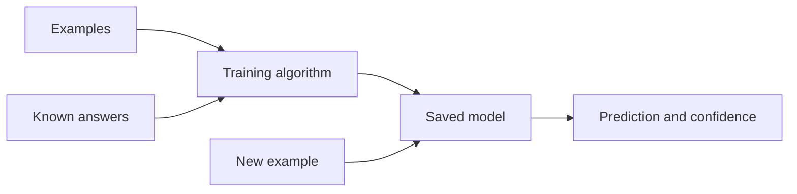
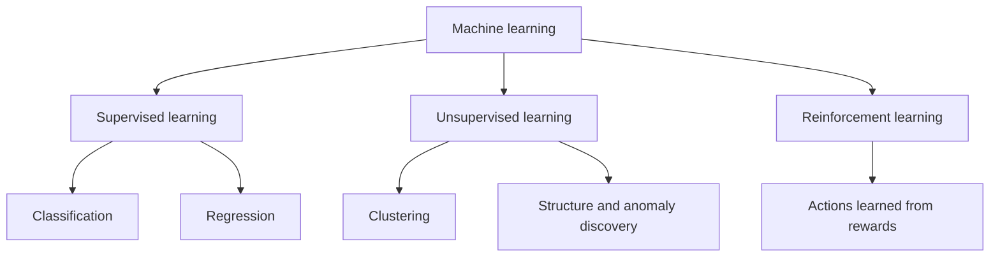

# What Is Machine Learning?

Machine learning is a way to build software from examples. Instead of writing
every rule by hand, you give an algorithm data and a goal; training finds a
model that can make useful predictions on new data.

For example, rows of past support messages and their correct departments can
train a classifier. After training, a new message goes into the saved model and
a predicted department comes out. The important question is not whether the
model remembers the training rows; it is whether it works on representative
rows it did not see during training.

## Five useful terms

| Term            | Plain-language meaning                              | Example                             |
| --------------- | --------------------------------------------------- | ----------------------------------- |
| Example         | One case the model can learn from or predict        | One customer, image or message      |
| Feature         | Information available when the prediction is made   | Account age, words in a message     |
| Target or label | The answer to learn during supervised training      | `will_churn`, `billing_question`    |
| Model           | The learned relationship between inputs and outputs | A CatBoost classifier               |
| Inference       | Using a trained model on new input                  | Predicting the next support message |

## The main types of machine learning

### Supervised learning

Supervised learning uses examples with known answers. **Classification**
predicts a category; **regression** predicts a number. Most AnyLearning training
projects (including image classification, object detection, keypoints, Tabular
AI and Text AI classification) are supervised.

### Unsupervised learning

Unsupervised learning looks for structure without a target label. Clustering,
dimensionality reduction and anomaly discovery are common examples. They can be
useful for exploration, but a cluster is not automatically a business category
and an outlier is not automatically an error. AnyLearning does not currently
train an unsupervised model.

### Reinforcement learning

Reinforcement learning learns a policy by taking actions and receiving rewards
over time. It is used in areas such as control, games and sequential decisions.
It needs a carefully designed environment and reward, not just a spreadsheet of
independent rows, and is outside AnyLearning's current project types.

## Where generative AI and LLMs fit

A large language model is a model trained to generate or transform sequences of
text. It is machine learning, but machine learning is much broader than LLMs.
AnyLearning's **Text AI** classifier is classical supervised NLP; its search is
a lexical baseline; its response evaluator measures saved output from any
source. Those workflows do not load or train a generative LLM.

## A model is one part of a system

Useful machine learning also needs representative data, an honest evaluation,
a review path, and a plan for mistakes. Start with the decision the prediction
will support, then choose the workflow, not the other way around.

Continue with [Choosing a machine-learning task](/docs/choosing-an-ml-task),
then learn how to [train, validate and test without leakage](/docs/evaluating-ml-models).
